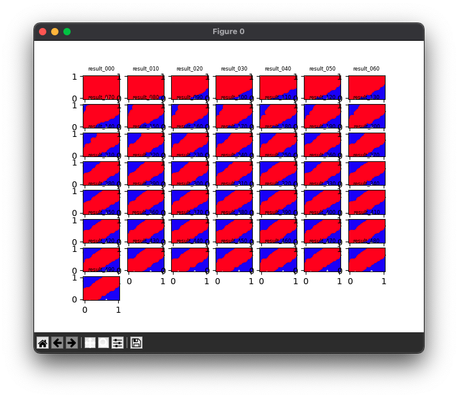
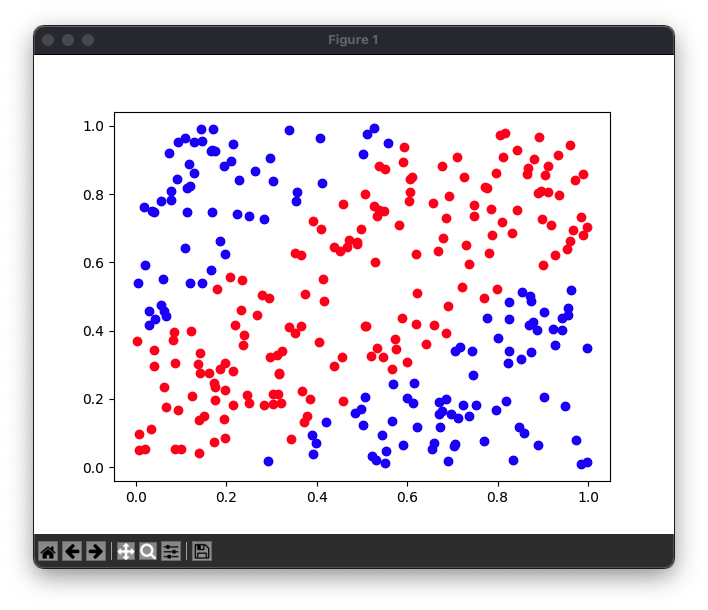

# XOR Neural Network in Rust

| Train | Test |
|:---:|:---:|
|  |  |

This project is a simple XOR neural network written in Rust. It trains a neural network to solve an XOR problem and uses the trained model to make predictions.

## Main components
`Model`: A structure representing a neural network model, which contains multiple layers, each representing a part of the neural network. Model provides methods to train, predict, calculate loss, and record results.

`Layer`: A trait representing each layer of the neural network. In this project, we implement layers such as Dense, ReLU, and Sigmoid.

`generate_xor_data`: A function to generate XOR data. This function generates training data and test data of a given size.

## How to use
### Train a model
``` shell
cargo build
cargo run
```

### Visualize the results
``` shell
conda create -n ml python=3.11
conda activate ml
pip install matplotlib
python xor_viewer.py
```

## Caution
The project writes the results generated during the training process to the `out/train` and `out/test` directories. Therefore, you should back up the contents of those directories if you want to preserve the previous results before running the program.
